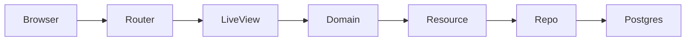
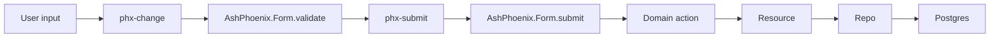

# Dataflow

Update this diagram when adding new domains, new LiveView entry points, or significant request flows.

## Request flow (read path)

- **Router**: `lib/tunez_web/router.ex` matches path to LiveView.
- **LiveView**: `mount` or `handle_params` runs; data loaded via `Tunez.Music.read_*` or `Tunez.Music.get_*_by_id!`.
- **Domain**: `lib/tunez/music.ex` defines interface (e.g. `read_artists`, `get_artist_by_id`).
- **Resource**: `lib/tunez/music/*.ex` (e.g. Artist, Album); AshPostgres/Repo → database.

## Form flow (create/update)

- **Mount**: Form built with `form_to_create_*()` or `form_to_update_*(record)`; assigned as `to_form(form)`.
- **phx-change** → `handle_event("validate", ...)` → `AshPhoenix.Form.validate(form, form_data)`; socket assign updated.
- **phx-submit** → `handle_event("save", ...)` → `AshPhoenix.Form.submit(form, params: form_data)` → `{:ok, record}` (flash + push_navigate) or `{:error, form}` (assign form + flash error).
- **Domain action** → e.g. `create_album`, `update_album` in `lib/tunez/music.ex`; **Resource** → AshPostgres / Repo → Postgres.
